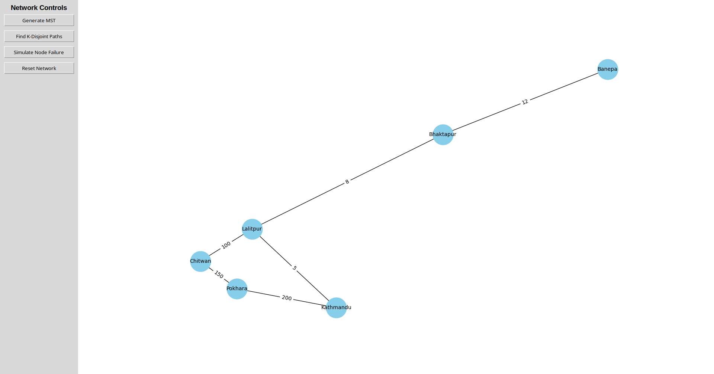
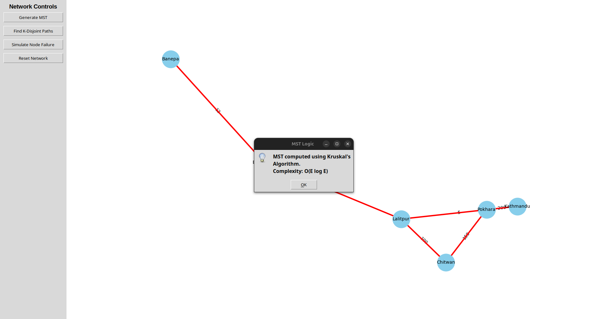
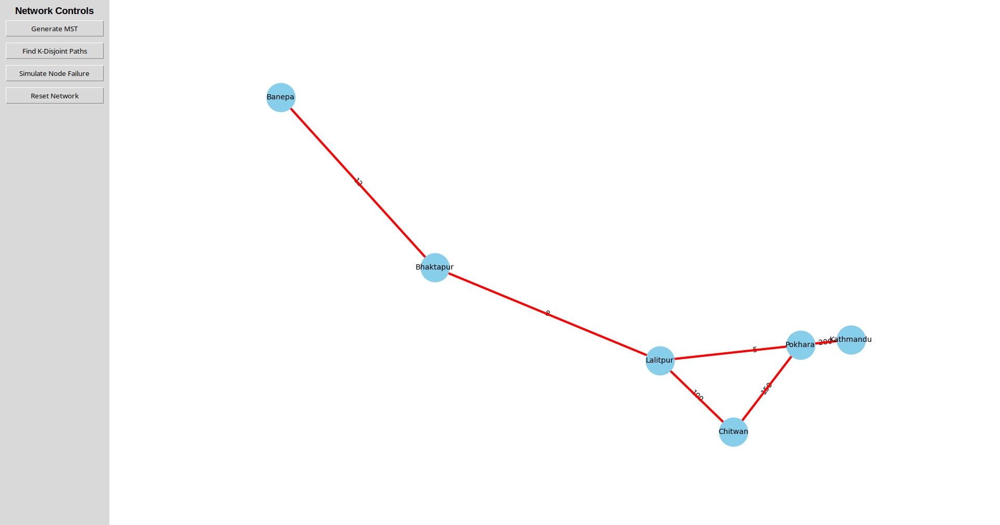
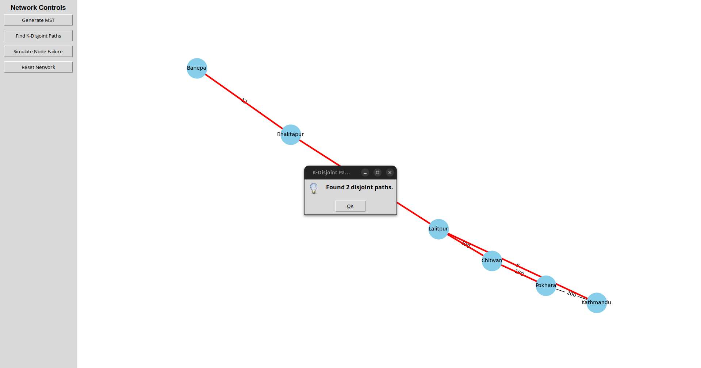
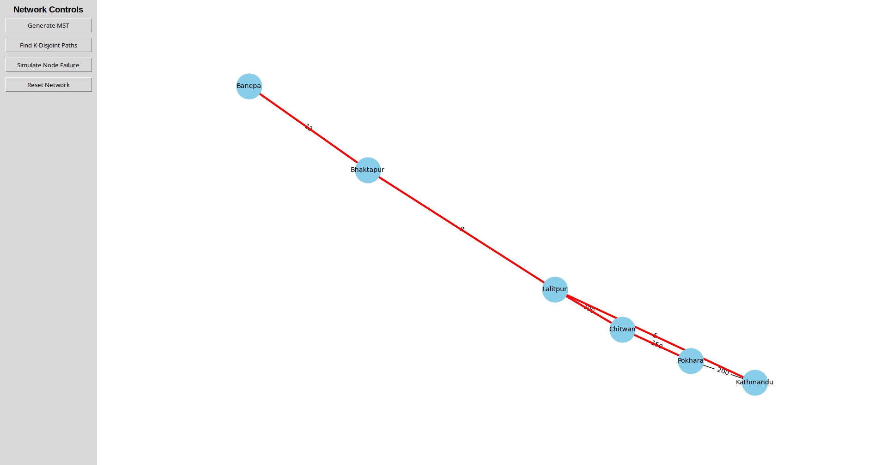
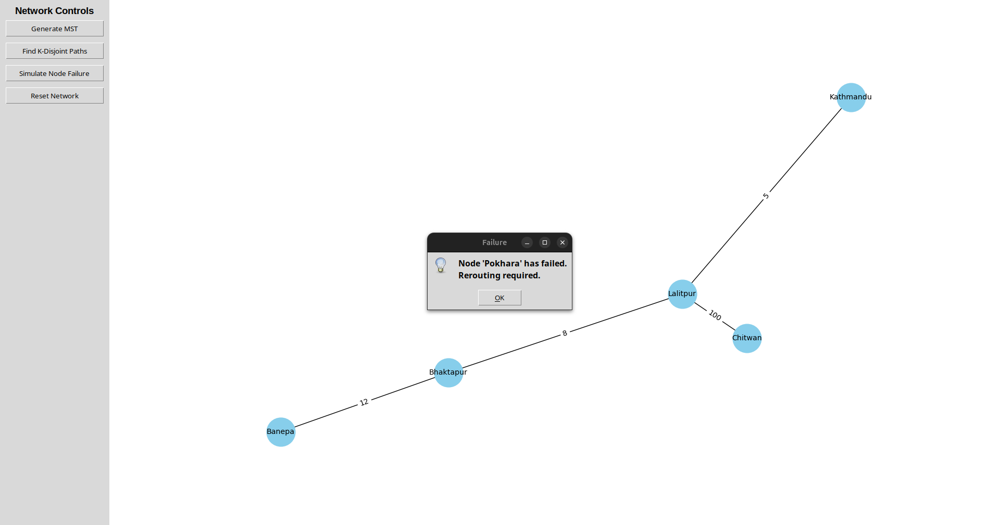
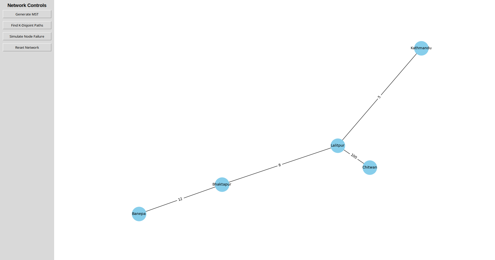
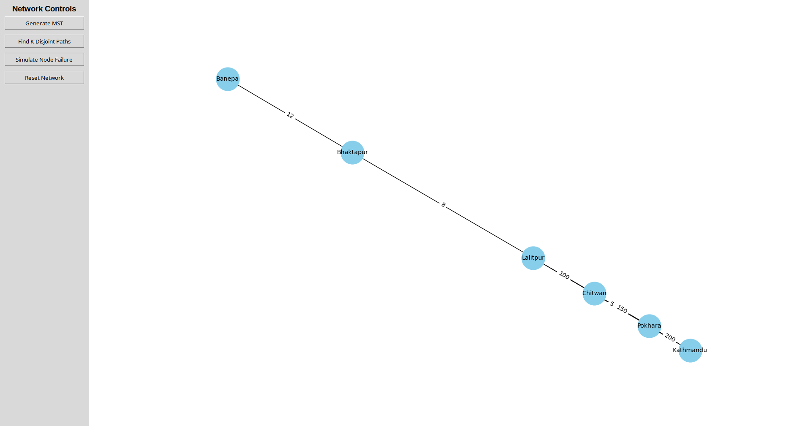

# Advanced Algorithms Project

A comprehensive collection of algorithm implementations solving real-world optimization and computational problems using Python.

## 📁 Project Structure

```
Advance Algorithm/
│
├── Question One/
│   ├── a.py                    # Sensor Placement using Geometric Median
│   └── b.py                    # TSP Simulated Annealing
│
├── Question Two/
│   └── trategictileshatter.py  # Strategic Tile Shatter (Dynamic Programming)
│
├── Question Three/
│   └── ServiceCenter.py        # Minimum Service Centers (Tree Algorithm)
│
├── Question Four/
│   └── SmartGrid.py            # Energy Distribution Optimization
│
├── Question Five/
│   ├── GUI.py                  # Emergency Network Simulator (Tkinter GUI)
│   └── 5b_threading.py         # Multi-threaded Merge Sort
│
├── Question Six/
│   └── heap.py                 # Graph Search Algorithms (DFS, BFS, A*)
│
├── Images/
│   ├── main.png                # Main GUI interface
│   ├── mst.png                 # MST visualization (before)
│   ├── mst_.png                # MST visualization (highlighted)
│   ├── kdisjoint.png           # K-disjoint paths (before)
│   ├── kdisjoint_.png          # K-disjoint paths (result)
│   ├── nodefailure.png         # Node failure simulation (before)
│   ├── nodefailure_.png        # Node failure simulation (after)
│   └── reset.png               # Reset network view
│
└── README.md                   # This file
```

## 🚀 Features

### Question 1: Optimization Algorithms

#### a.py - Sensor Placement Optimization
- **Algorithm**: Geometric Median Calculation
- **Purpose**: Find optimal hub position to minimize total distance to all sensors
- **Method**: Iterative Weiszfeld's algorithm
- **Complexity**: O(n × iterations)
- **Use Case**: IoT sensor network optimization

**Key Functions:**
- `get_geometric_median(locations, threshold)` - Calculates optimal hub location

**Example Usage:**
```bash
python a.py
```

**Sample Output:**
```
Question 1(a): Sensor Placement
Optimal Hub: [1. 1.]
Minimum Distance Sum: 4.00000
```

#### b.py - Traveling Salesman Problem (TSP)
- **Algorithm**: Simulated Annealing
- **Purpose**: Find near-optimal tour visiting all cities
- **Cooling Schedules**: 
  - Exponential: T = T × α (α = 0.995)
  - Linear: T = T - β (β = 0.5)
- **Neighborhood**: 2-opt edge reversal
- **Complexity**: O(n² × iterations)

**Key Functions:**
- `calculate_tour_distance(tour, cities)` - Computes total tour distance
- `simulated_annealing(cities, schedule)` - Finds optimal tour

**Example Usage:**
```bash
python b.py
```

**Sample Output:**
```
Question 1(b): TSP Simulated Annealing
Results using exponential cooling: 7842.34
Results using linear cooling: 8156.72
```

---

### Question 2: Strategic Tile Shatter

#### trategictileshatter.py - Maximum Points Game
- **Algorithm**: Dynamic Programming (Interval DP)
- **Purpose**: Maximize points by strategically shattering tiles
- **Complexity**: O(n³)
- **Problem Type**: Burst Balloons variant

**Rules:**
- Each tile has a multiplier
- Points = left_multiplier × tile_multiplier × right_multiplier
- Choose optimal shattering order

**Key Functions:**
- `max_points(tile_multipliers)` - Computes maximum achievable points

**Example Usage:**
```bash
python trategictileshatter.py
```

**Sample Output:**
```
Example 1 Output: 167
Example 2 Output: 10
```

---

### Question 3: Service Center Placement

#### ServiceCenter.py - Minimum Service Centers in Tree
- **Algorithm**: Tree Dynamic Programming with DFS
- **Purpose**: Minimize service centers needed to cover all nodes
- **Complexity**: O(n)
- **Problem Type**: Dominating Set on Trees

**States:**
- 0: Node is NOT covered
- 1: Node HAS a service center
- 2: Node IS covered by another node

**Key Classes & Functions:**
- `TreeNode` - Binary tree node structure
- `min_service_centers(root)` - Finds minimum centers needed
- `build_tree()` - Constructs sample tree

**Example Usage:**
```bash
python ServiceCenter.py
```

**Sample Output:**
```
Minimum Service Centers Required: 2
```

---

### Question 4: Smart Grid Energy Optimization

#### SmartGrid.py - Energy Distribution System
- **Algorithm**: Greedy Allocation with Time-based Constraints
- **Purpose**: Optimize energy distribution across districts
- **Features**:
  - Multi-source allocation (Solar, Hydro, Diesel)
  - Time-based availability windows
  - Cost optimization
  - Renewable energy tracking

**Key Functions:**
- `optimize_energy_distribution(demand_data, source_data)` - Allocates energy optimally

**Data Models:**
- **Demand Table**: Hourly energy demand per district
- **Source Table**: Energy sources with capacity, availability, and cost

**Example Usage:**
```bash
python SmartGrid.py
```

**Sample Output:**
```
Hour  | Dist       | Solar  | Hydro  | Diesel | Total  | Demand | % Met
---------------------------------------------------------------------------
6     | District A | 20     | 0      | 0      | 20     | 20     | 100.0%
6     | District B | 15     | 0      | 0      | 15     | 15     | 100.0%
...

Total Cost: Rs. 215.5
Renewable Energy Usage: 72.34%
```

---

### Question 5: Emergency Network & Threading

#### GUI.py - Interactive Network Visualization
- **Framework**: Tkinter + NetworkX + Matplotlib
- **Purpose**: Simulate and visualize emergency response networks
- **Algorithms**:
  - Minimum Spanning Tree (Kruskal's Algorithm)
  - K-Disjoint Paths (Redundant routing)
  - Node Failure Simulation

**Features:**
1. **Generate MST** - Visualizes optimal network backbone
2. **Find K-Disjoint Paths** - Identifies redundant routes
3. **Simulate Node Failure** - Tests network resilience
4. **Reset Network** - Restores original topology

**Key Components:**
- `EmergencySimulator` class - Main application
- `add_sample_data()` - Initializes Nepal city network
- `visualize_mst()` - Highlights minimum spanning tree
- `find_k_paths()` - Finds edge-disjoint paths
- `fail_node()` - Simulates node failure
- `draw_graph()` - Renders network visualization

**Example Usage:**
```bash
python GUI.py
```

**GUI Controls:**
- Click "Generate MST" to see optimal connections (red edges)
- Click "Find K-Disjoint Paths" to find redundant routes
- Click "Simulate Node Failure" to remove Pokhara node
- Click "Reset Network" to restore original network

**Network Data:**
- Preloaded cities: Kathmandu, Lalitpur, Bhaktapur, Pokhara, Chitwan, Banepa
- Weighted edges representing distances

#### 5b_threading.py - Multi-threaded Merge Sort
- **Algorithm**: Parallel Merge Sort using Threading
- **Purpose**: Demonstrate concurrent sorting with thread synchronization
- **Complexity**: O(n log n) with parallel speedup
- **Threading Model**: Parent-child thread coordination

**Implementation Details:**
- **Global Arrays**: `original_list` and `sorted_list`
- **Thread 1**: Sorts first half of array
- **Thread 2**: Sorts second half of array
- **Thread 3**: Merges both sorted halves
- **Synchronization**: Uses `join()` to ensure proper ordering

**Key Functions:**
- `sorting_thread_func(start_index, end_index)` - Sorts subarray segment
- `merging_thread_func(mid)` - Merges two sorted halves
- Uses Python's `threading.Thread` for concurrent execution

**Example Usage:**
```bash
python 5b_threading.py
```

**Sample Output:**
```
Original List: [7, 12, 19, 3, 18, 4, 2, 6, 15, 8]
Thread sorting range 0 to 5: [3, 7, 12, 18, 19]
Thread sorting range 5 to 10: [2, 4, 6, 8, 15]
Merging thread completed. Result: [2, 3, 4, 6, 7, 8, 12, 15, 18, 19]
Final Sorted List: [2, 3, 4, 6, 7, 8, 12, 15, 18, 19]
```

**Thread Execution Flow:**
```
Parent Thread
    ├─> Thread 0 (Sort left half)  ──┐
    ├─> Thread 1 (Sort right half) ──┤ join()
    └─> Thread 2 (Merge both)      ──┘ join()
Final Output
```

---

### Question 6: Graph Search Algorithms

#### heap.py - Pathfinding on Polish Road Network
- **Algorithms**: DFS, BFS, A* Search
- **Purpose**: Compare uninformed vs informed search strategies
- **Graph**: Polish cities with road distances
- **Heuristic**: Straight-line distances to goal (Plock)

**Algorithm Details:**

**1. Depth-First Search (DFS)**
- **Strategy**: Explores deepest path first (LIFO)
- **Data Structure**: Stack
- **Completeness**: Not guaranteed on infinite graphs
- **Optimality**: Not guaranteed

**2. Breadth-First Search (BFS)**
- **Strategy**: Explores level by level (FIFO)
- **Data Structure**: Queue
- **Completeness**: Yes
- **Optimality**: Yes (for unweighted graphs)

**3. A* Search**
- **Strategy**: Best-first search with heuristic
- **Data Structure**: Priority Queue (min-heap)
- **Evaluation Function**: f(n) = g(n) + h(n)
  - g(n) = actual cost from start
  - h(n) = heuristic (straight-line distance)
- **Completeness**: Yes
- **Optimality**: Yes (with admissible heuristic)

**Key Functions:**
- `search_algo(type)` - Generic search implementation for all three algorithms
- Unified interface switching between DFS, BFS, and A*

**Graph Data:**
- **17 Polish cities** including Glogow, Poznań, Warsaw, Kraków, etc.
- **Start**: Glogow
- **Goal**: Plock
- **Edge weights**: Actual road distances in km
- **Heuristic values**: Straight-line distances to Plock

**Example Usage:**
```bash
python heap.py
```

**Sample Output:**
```
DFS Path: ['Glogow', 'Poznań', 'Bydgoszcz', 'Włocławek', 'Plock']
BFS Path: ['Glogow', 'Poznań', 'Bydgoszcz', 'Włocławek', 'Plock']
A* Path: ['Glogow', 'Poznań', 'Bydgoszcz', 'Włocławek', 'Plock']
```

**Performance Comparison:**
| Algorithm | Nodes Explored | Path Found | Optimal? |
|-----------|----------------|------------|----------|
| DFS       | Variable       | Yes        | No       |
| BFS       | More           | Yes        | Yes*     |
| A*        | Fewer          | Yes        | Yes      |

*BFS is optimal for unweighted graphs; A* is optimal with admissible heuristic

---

## 📸 Screenshots

The `Images/` folder contains visual documentation of the Emergency Network Simulator:

### Main Interface

- Clean interface with control panel and graph visualization
- Four action buttons for network operations

### MST Generation
|  | |
|--------|-------|
|  |  |
- Shows Kruskal's algorithm highlighting minimum spanning tree in red

### K-Disjoint Paths
|  | |
|--------|-------|
|  |  |
- Demonstrates finding multiple independent paths for redundancy

### Node Failure Simulation
| | |
|--------|-------|
|  |  |
- Shows network resilience when Pokhara node fails

### Network Reset

- Returns to original network configuration

---

## 🛠️ Installation & Setup

### Prerequisites
```bash
python 3.8+
```

### Required Libraries
```bash
pip install numpy
pip install networkx
pip install matplotlib
pip install tkinter  # Usually comes with Python
```

### Alternative: Install all at once
```bash
pip install numpy networkx matplotlib
```

### Verify Installation
```bash
python -m tkinter  # Should open a test window
python -c "import numpy, networkx, matplotlib; print('All libraries installed!')"
```

---

## 📊 Algorithm Complexity Summary

| Problem | Algorithm | Time Complexity | Space Complexity |
|---------|-----------|-----------------|------------------|
| Sensor Placement | Geometric Median | O(n × k) | O(n) |
| TSP | Simulated Annealing | O(n² × iterations) | O(n) |
| Tile Shatter | Dynamic Programming | O(n³) | O(n²) |
| Service Centers | Tree DP | O(n) | O(h) |
| Smart Grid | Greedy Allocation | O(h × d × s) | O(h × d) |
| Network MST | Kruskal's Algorithm | O(E log E) | O(V + E) |
| Threaded Sort | Parallel Merge Sort | O(n log n) | O(n) |
| DFS/BFS | Graph Traversal | O(V + E) | O(V) |
| A* Search | Informed Search | O(b^d) | O(b^d) |

*where: n = problem size, k = iterations, h = tree height/hours, d = districts, s = sources, V = vertices, E = edges, b = branching factor, d = depth*

---

## 🎯 Key Concepts Demonstrated

1. **Optimization Techniques**
   - Geometric algorithms
   - Metaheuristics (Simulated Annealing)
   - Greedy algorithms

2. **Dynamic Programming**
   - Interval DP
   - Tree DP

3. **Graph Algorithms**
   - Minimum Spanning Tree
   - Path finding (DFS, BFS, A*)
   - Network resilience
   - Heuristic search

4. **Parallel Computing**
   - Multi-threading
   - Thread synchronization
   - Concurrent sorting

5. **Real-World Applications**
   - IoT network design
   - Route optimization
   - Resource allocation
   - Infrastructure planning
   - Energy management
   - Emergency response systems

---

## 📖 Usage Examples

### Running Individual Scripts

```bash
# Question 1a: Sensor placement
cd "Question One"
python a.py

# Question 1b: TSP optimization
python b.py

# Question 2: Tile shatter game
cd "../Question Two"
python trategictileshatter.py

# Question 3: Service center optimization
cd "../Question Three"
python ServiceCenter.py

# Question 4: Energy distribution
cd "../Question Four"
python SmartGrid.py

# Question 5a: Network simulator GUI
cd "../Question Five"
python GUI.py

# Question 5b: Multi-threaded sorting
python 5b_threading.py

# Question 6: Graph search algorithms
cd "../Question Six"
python heap.py
```

### Running All Tests
```bash
# Create a simple test runner
for dir in "Question One" "Question Two" "Question Three" "Question Four" "Question Six"; do
    cd "$dir"
    for file in *.py; do
        echo "Running $file..."
        python "$file"
    done
    cd ..
done
```

---

## 🔧 Customization

### Modifying Question 1a - Sensor Locations
Edit `a.py`:
```python
ex1_sensors = [[0,1], [1,0], [1,2], [2,1]]  # Add your coordinates
```

### Modifying Question 1b - City Count
Edit `b.py`:
```python
num_cities = 30  # Change to desired number
```

### Modifying Question 4 - Energy Data
Edit `SmartGrid.py`:
```python
demand_table = [
    {"hour": 6, "District A": 20, "District B": 15, "District C": 25},
    # Add more hourly data
]
```

### Modifying Question 5a - Network Topology
Edit `GUI.py`:
```python
edges = [
    ('City1', 'City2', distance),
    # Add more edges
]
```

### Modifying Question 5b - Array Size
Edit `5b_threading.py`:
```python
original_list = [7, 12, 19, 3, 18, 4, 2, 6, 15, 8]  # Modify list
```

### Modifying Question 6 - Graph Structure
Edit `heap.py`:
```python
graph = {
    'CityA': [('CityB', distance), ...],
    # Add more cities and connections
}

heuristic = {
    'CityA': straight_line_distance_to_goal,
    # Add heuristic values
}
```

---

## 🧪 Testing

### Individual Tests
All scripts include built-in test cases and can be run directly:

```bash
python <script_name>.py
```

### Expected Outputs

**Question 1a:**
```
Optimal Hub: [1. 1.]
Minimum Distance Sum: 4.00000
```

**Question 1b:**
```
Results using exponential cooling: ~7800-8000
Results using linear cooling: ~8000-8300
```

**Question 2:**
```
Example 1 Output: 167
Example 2 Output: 10
```

**Question 3:**
```
Minimum Service Centers Required: 2
```

**Question 5b:**
```
Final Sorted List: [2, 3, 4, 6, 7, 8, 12, 15, 18, 19]
```

**Question 6:**
```
All three algorithms should find a valid path from Glogow to Plock
A* typically finds the shortest path most efficiently
```

---


## 📝 Notes

- **Question 1a**: Uses Weiszfeld's algorithm for geometric median calculation
- **Question 1b**: Compares exponential vs linear cooling schedules
- **Question 2**: Implements interval DP similar to burst balloons problem
- **Question 3**: Uses tree DP with three states (uncovered, has center, covered)
- **Question 4**: Prioritizes renewable energy sources by cost
- **Question 5a**: Interactive visualization requires display environment (X11, Wayland, etc.)
- **Question 5b**: Demonstrates thread synchronization with join() operations
- **Question 6**: A* uses admissible heuristic (straight-line distance) for optimality

---

## 🐛 Troubleshooting

### GUI doesn't display (Question 5a)
- Ensure `tkinter` is installed: `python -m tkinter`
- On Linux: `sudo apt-get install python3-tk`
- On macOS: Tkinter comes with Python
- On Windows: Reinstall Python with Tk/Tcl option

### Import errors
```bash
pip install --upgrade numpy networkx matplotlib
```


```

### Threading issues (Question 5b)
- Ensure Python version is 3.x
- Threading module is built-in, no installation needed
- If race conditions occur, results may vary slightly

### Graph search returns None (Question 6)
- Verify graph connectivity
- Check start and goal nodes exist in graph
- Ensure heuristic values are defined for all nodes

---

## 📚 References

### Algorithms
- **Geometric Median**: Weiszfeld's Algorithm
- **Simulated Annealing**: Kirkpatrick et al. (1983)
- **Dynamic Programming**: Bellman's Principle of Optimality
- **Kruskal's Algorithm**: MST construction
- **A* Search**: Hart, Nilsson, and Raphael (1968)
- **Merge Sort**: Divide and Conquer paradigm

### Libraries
- **NetworkX**: Graph algorithms and visualization
- **NumPy**: Numerical computing
- **Matplotlib**: Plotting and visualization
- **Threading**: Python standard library for concurrency
- **Heapq**: Priority queue implementation

### Problem Types
- Facility Location Problem
- Traveling Salesman Problem
- Interval Dynamic Programming
- Set Cover Problem
- Resource Allocation
- Graph Search

---

## 📄 License

This project is for educational purposes.

---

## 👥 Authors

Created as part of Advanced Algorithms coursework by Prajwal Bhandari.

---

## 🎓 Learning Objectives

Students will learn:
- How to apply optimization algorithms to real problems
- Dynamic programming techniques
- Graph algorithm implementation
- GUI development with Python
- Multi-threading and synchronization
- Informed vs uninformed search strategies
- Algorithm complexity analysis
- Trade-offs between solution quality and computation time
- Parallel computing concepts
- Heuristic design for A* search

---

## 🌟 Project Highlights

### Algorithmic Diversity
- **6 different problem domains** covered
- **10+ algorithms** implemented
- **3 search strategies** compared

### Practical Applications
- Emergency network planning (Nepal cities)
- Energy distribution (renewable vs non-renewable)
- Polish road network pathfinding
- Multi-threaded data processing

### Interactive Elements
- Full GUI application with network visualization
- Real-time MST generation
- Node failure simulation
- Visual feedback for all operations

### Code Quality
- Well-documented functions
- Complexity analysis provided
- Modular design
- Reusable components

---

